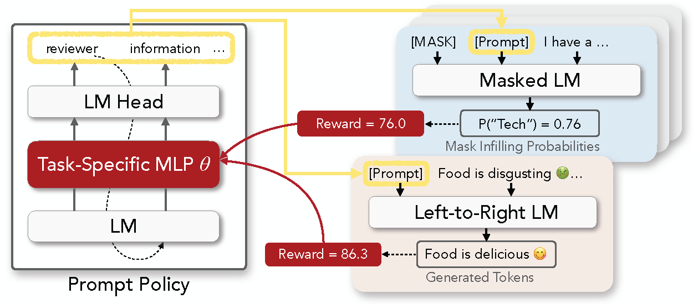

# RL Prompt

This repo contains the code of the discrete prompt optimization framework described in the paper \
**[RLPrompt: Optimizing Discrete Text Prompts With Reinforcement Learning](https://arxiv.org/abs/2205.12548)** \
Mingkai Deng*,   Jianyu Wang*,   Cheng-Ping Hsieh* (equal contribution),   Yihan Wang,   Han Guo,   Tianmin Shu,   Meng Song,   Eric P. Xing,   Zhiting Hu 

We will keep updating the codebase for easier usage and adaptation for your own tasks, so please stay tuned by starring or watching our repo! 

## Getting Started

* Extensive [recent work](https://arxiv.org/abs/2107.13586) has shown that *prompting* pre-trained LMs with specific text can steer them to perform various NLP tasks, without needing to update the model
* Previous work has typically tuned soft prompts with gradient-based optimization or searched for discrete text prompts using various heuristics
* In our paper, we propose to formulate discrete prompt optimization as an RL problem, and train a policy network to generate the prompt that optimizes a reward function
* Compared to typical soft prompts, our discrete prompts are lightweight, interpretable, and transferrable across model types (e.g., RoBERTa to GPT-2) and sizes (e.g., small to large)
* Check out more analyses at our paper [here](https://arxiv.org/abs/2205.12548)



## Setting Up (Minimal)

To run the codebase, we provide a minimal set of required configurations: 
* Python >= 3.7
* PyTorch >= 1.10.1 (install from the [official website](https://pytorch.org/get-started/locally/))

Install other libraries by
```
pip install -r requirements-minimal.txt
```

## Setting Up (Full)

To fully reproduce our environment, use
* Python == 3.8
* PyTorch == 1.10.1

Install all dependencies by 
```
pip install -r requirements-full.txt
```

## Usage

Our policy network is in `modules/models.py`, and we combine prompts with LMs to compute the reward function in `sql/rewards.py`

Below are the commands we use to run the experiments for 1) few-shot text classification and 2) text style transfer, as described in our paper.

### Few-Shot Text Classification
The script below runs a 16-shot classification experiment, with options for `task_lm` and `dataset`.
For each dataset, we provide 5 different 16-shot training sets, toggled by `dataset_seed`
```
bash scripts/run_few_shot_classification.sh [task_lm:distilroberta-base,roberta-base,roberta-large,distilgpt2,gpt2,gpt2-medium,gpt2-large,gpt2-xl] \
                                            [dataset:sst-2,yelp-2,mr,cr,agnews,sst-5,yelp-5] \
                                            [dataset_seed:0,1,2,3,4]
```

For example, to run on RoBERTa-large for SST-2 with `dataset_seed` of 0, enter the following:
```
bash scripts/run_few_shot_classification.sh roberta-large sst-2 0
```

### Text Style Transfer
We experiment on Yelp for sentiment and Shakespeare for authorship transfer, respectively. 
For Shakespeare, we test for [few-shot text style transfer](https://arxiv.org/abs/2010.03802) by only training on 100 examples per style. 
Like for few-shot classification, we provide 3 different training sets and their corresponding style classifiers.

You can download the training style classifiers by running the script below
```
python download_tst_classifiers.py --model_name [yelp-train,
                                                 shakespeare-train-100-0,
                                                 shakespeare-train-100-1,
                                                 shakespeare-train-100-2]
```

After that, run the experiment with the script below, with options for `task_lm`, `direction`, `dataset` and `dataset_seed`. 

For Yelp, `0to1` means negative-to-positive and vice versa. For Shakespeare, `0to1` means old-to-modern. `dataset_seed` only applies to Shakespeare.
```
bash scripts/run_text_style_transfer.sh [task_lm:distilgpt2,gpt2,gpt2-medium,gpt2-large,gpt2-xl] \
                                [direction:0to1,1to0] \
                                [dataset:yelp,shakespeare] \
                                [dataset_seed:0,1,2]
```

For instance, to run using GPT2-xl for old-to-modern transfer on Shakespeare with `dataset_seed` of 1, enter the following:
```
bash scripts/run_text_style_transfer.sh gpt2-xl 0to1 shakespeare 1
```

#### Evaluation
You can download the evaluation style classifiers as below
```
python download_tst_classifiers.py --model_name [yelp_test,shakespeare_test_all]
```
And the language models for perplexity as below
```
python download_ppl_lms.py --model_name [yelp,shakespeare]
```
And use the evaluation scripts in `evaluation/tst/modules` in the order below
```
generate_prompts.py -> prompted_gpt2.py -> yelp_output_selector.py -> yelp_evaluator.py
```
We will provide more information on this part soon. Please reach out if you have any questions while using it. 
